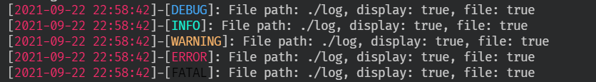

### 这是一个开箱即用的日志组件
**仅需要路径参数和是否在控制台打印，并且是否在控制台打印是pub的，你可以随时修改它。**
**默认按天分割文件**</br>
很遗憾目前还没有加入宏，会在后续的版本改进，推荐使用lazy_static宏全局使用。
# 例子

```rust
use std::{time, thread};
use flog::Log;
let log = Log::new("./log".to_string(), true);
loop {
    thread::sleep(time::Duration::from_secs(2));
    log.debug(&x);
    log.info(&x);
    log.warn(&x);
    log.error(&x);
    log.fatal(&x);
}
```

